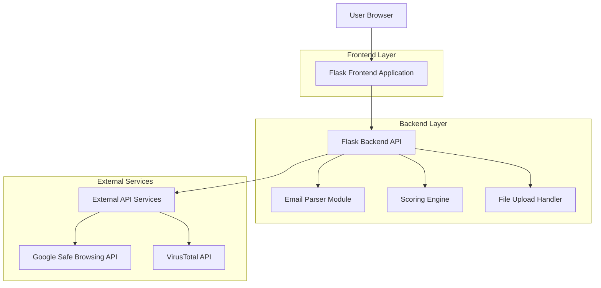
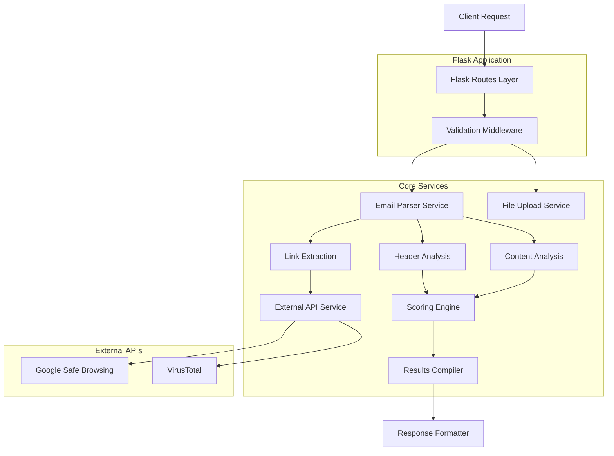
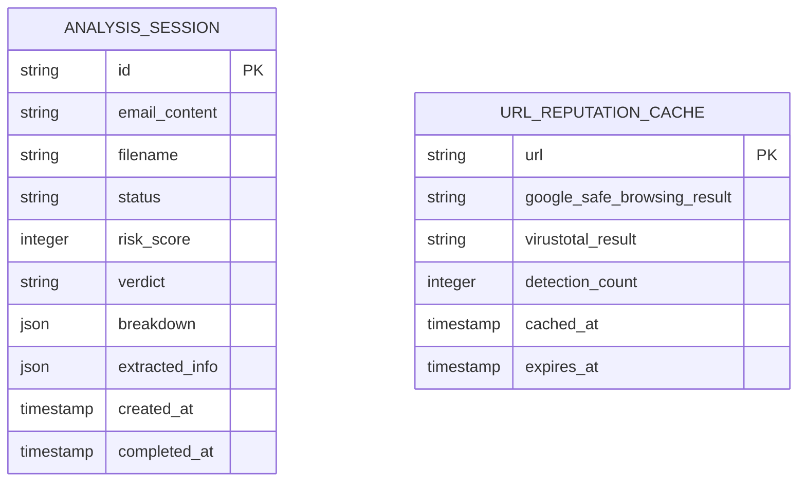

## 1. Architecture Design



## 2. Technology Description

- **Frontend**: HTML5 + CSS3 + JavaScript with Bootstrap 5
- **Backend**: Flask 2.3 with Python 3.9+
- **Email Processing**: Python built-in `email` module + BeautifulSoup4
- **External APIs**: Google Safe Browsing API v4, VirusTotal API v3
- **Deployment**: Docker + Render/Railway/Heroku ready
- **Initialization Tool**: pip with requirements.txt

## 3. Route Definitions

| Route | Purpose |
|-------|---------|
| / | Homepage with file upload interface and instructions |
| /upload | Handle file upload and text paste submissions |
| /analyze/<analysis_id> | Display analysis progress and results |
| /api/analyze | Backend API endpoint for email analysis |
| /health | Health check endpoint for monitoring |

## 4. API Definitions

### 4.1 Core API

**Email Analysis Endpoint**
```
POST /api/analyze
```

Request:
| Param Name | Param Type | isRequired | Description |
|------------|-------------|-------------|-------------|
| email_content | string | true | Raw email content as text |
| filename | string | false | Original filename for context |
| analysis_type | string | false | Type: 'file' or 'text' |

Response:
| Param Name | Param Type | Description |
|------------|-------------|-------------|
| analysis_id | string | Unique identifier for this analysis |
| status | string | Analysis status: 'processing', 'completed', 'error' |
| risk_score | integer | Calculated risk score (0-100) |
| verdict | string | Safety assessment: 'safe', 'suspicious', 'phishing' |
| breakdown | object | Detailed category breakdown with findings |
| extracted_info | object | Parsed email metadata and content |

Example Response:
```json
{
  "analysis_id": "550e8400-e29b-41d4-a716-446655440000",
  "status": "completed",
  "risk_score": 75,
  "verdict": "phishing",
  "breakdown": {
    "header_spoofing": {"score": 25, "findings": ["Display name mismatch", "Suspicious Reply-To"]},
    "sender_anomalies": {"score": 15, "findings": ["Typosquatting domain detected"]},
    "suspicious_links": {"score": 20, "findings": ["URL flagged by Google Safe Browsing", "Shortened URL detected"]},
    "urgency_language": {"score": 15, "findings": ["Urgent action required", "Account suspension threat"]}
  },
  "extracted_info": {
    "from": "support@paypaI.com",
    "subject": "Urgent: Verify your account now",
    "links": ["http://bit.ly/suspicious-link"],
    "attachments": []
  }
}
```

## 5. Server Architecture Diagram



## 6. Data Model

### 6.1 Analysis Session Storage (Optional Redis/Memory Cache)



### 6.2 Data Definition Language

**Analysis Sessions Table (for caching)**
```sql
-- This would be for Redis or in-memory storage, not a traditional SQL database
-- Session data structure for temporary analysis results
{
  "analysis_id": "uuid",
  "email_content": "text",
  "filename": "string",
  "status": "enum('processing', 'completed', 'error')",
  "risk_score": "integer",
  "verdict": "string",
  "breakdown": "json",
  "extracted_info": "json",
  "created_at": "timestamp",
  "completed_at": "timestamp",
  "expires_at": "timestamp"
}
```

## 7. Security Implementation

### 7.1 Input Validation
- File size validation (10MB limit)
- MIME type checking for uploaded files
- Content sanitization for pasted email text
- Path traversal protection for file uploads

### 7.2 API Security
- Environment variable protection for API keys
- Rate limiting on external API calls (4 req/min for VirusTotal)
- Request timeout handling (30 seconds max)
- Error message sanitization (no stack traces to client)

### 7.3 File Handling Security
- Temporary file cleanup after analysis
- No execution of email attachments
- Content-Type validation before processing
- Memory usage limits for large emails

## 8. External API Integration

### 8.1 Google Safe Browsing API
```python
# Environment: GOOGLE_SAFE_BROWSING_API_KEY
# Endpoint: https://safebrowsing.googleapis.com/v4/threatMatches:find
# Rate limit: 10,000 requests per day
```

### 8.2 VirusTotal API
```python
# Environment: VIRUSTOTAL_API_KEY  
# Endpoint: https://www.virustotal.com/api/v3/urls
# Rate limit: 4 requests per minute, 500 per day
# Implementation: Queue system with delays
```

## 9. Deployment Configuration

### 9.1 Environment Variables
```bash
FLASK_ENV=production
FLASK_APP=app.py
SECRET_KEY=your-secret-key
GOOGLE_SAFE_BROWSING_API_KEY=your-google-api-key
VIRUSTOTAL_API_KEY=your-virustotal-api-key
MAX_FILE_SIZE=10485760  # 10MB in bytes
SESSION_TIMEOUT=3600  # 1 hour
```

### 9.2 Docker Configuration
```dockerfile
FROM python:3.9-slim
WORKDIR /app
COPY requirements.txt .
RUN pip install -r requirements.txt
COPY . .
EXPOSE 5000
CMD ["gunicorn", "--bind", "0.0.0.0:5000", "app:app"]
```

### 9.3 Production Deployment
- Use Gunicorn WSGI server
- Nginx reverse proxy for static files
- Environment-based configuration
- Health check endpoint for monitoring
- Log rotation and error tracking