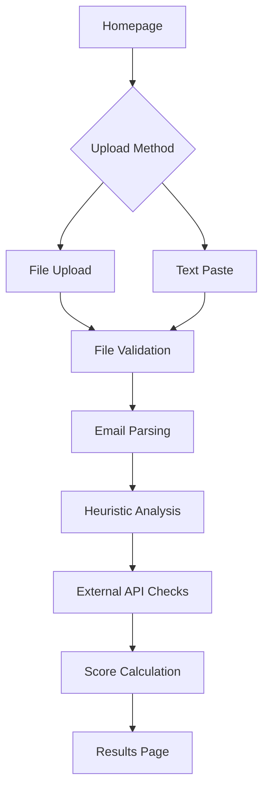

## 1. Product Overview
A professional web application that analyzes suspicious email files (.eml format) to detect phishing attempts. Users upload email files and receive detailed risk assessments with visual reports showing threat levels, detected indicators, and safety recommendations.

This tool helps individuals and organizations identify potentially malicious emails before they cause harm, serving as a critical security utility in today's threat landscape.

## 2. Core Features

### 2.1 User Roles
| Role | Registration Method | Core Permissions |
|------|---------------------|------------------|
| Guest User | No registration required | Upload and analyze email files, view analysis results |

### 2.2 Feature Module
Our phishing email detector consists of the following main pages:
1. **Homepage**: File upload interface with clear instructions for exporting .eml files from major email clients
2. **Analysis Results Page**: Detailed risk assessment with score visualization, threat breakdown, and safety recommendations

### 2.3 Page Details
| Page Name | Module Name | Feature description |
|-----------|-------------|---------------------|
| Homepage | File Upload Section | Drag-and-drop or click-to-upload interface accepting .eml, .msg files with 10MB size limit |
| Homepage | Export Instructions | Step-by-step guides with screenshots for Gmail, Outlook, Yahoo, Apple Mail email export procedures |
| Homepage | Fallback Text Input | Large textarea for pasting raw email source when file upload isn't possible |
| Analysis Results | Progress Indicator | Visual loading state while analyzing email content and checking external APIs |
| Analysis Results | Risk Score Display | Large circular gauge (0-100) with color coding: green (0-30), yellow (31-60), red (61-100) |
| Analysis Results | Verdict Statement | Clear safety assessment: "Likely Safe", "Suspicious", or "Likely Phishing" |
| Analysis Results | Threat Breakdown | Categorized analysis of Headers, Sender, Body Text, Links, Attachments with detected red flags |
| Analysis Results | Extracted Information | Display sender details, subject, key headers, all links with reputation status, attachment names/types |
| Analysis Results | Red Flag Highlights | Visually emphasize suspicious elements like mismatched domains, suspicious links, dangerous attachments |

## 3. Core Process
**User Flow**: Homepage → Upload File → Analysis Progress → Results Page

1. User lands on homepage with prominent upload button
2. User uploads .eml file or pastes email source
3. System validates file format and extracts email components
4. Analysis engine applies heuristic scoring across multiple categories
5. External APIs check URL reputation (Google Safe Browsing, VirusTotal)
6. Results page displays comprehensive threat assessment

## 4. User Interface Design

### 4.1 Design Style
- **Primary Colors**: Professional blue (#2563eb) for primary actions, red (#dc2626) for high risk, green (#16a34a) for safe
- **Secondary Colors**: Gray gradients for neutral elements, yellow (#f59e0b) for medium risk
- **Button Style**: Rounded corners with subtle shadows, hover effects for interactivity
- **Typography**: Clean sans-serif (Inter or system fonts), 16px base size with clear hierarchy
- **Layout**: Card-based design with proper spacing, centered content with max-width constraints
- **Icons**: Professional security-themed icons (shield, warning, checkmark) from Font Awesome or similar

### 4.2 Page Design Overview
| Page Name | Module Name | UI Elements |
|-----------|-------------|-------------|
| Homepage | Upload Section | Large dropzone with dashed border, file type icons, upload progress bar, clear file size limits |
| Homepage | Instructions | Accordion-style expandable sections with email client logos, numbered steps, screenshot placeholders |
| Analysis Results | Score Gauge | Circular progress indicator with animated fill, large numeric display, color-coded background |
| Analysis Results | Threat Categories | Expandable cards with category icons, threat count badges, detailed findings in nested lists |
| Analysis Results | Link Reputation | Table format with URL, reputation status badges, external link indicators |

### 4.3 Responsiveness
Desktop-first design with full mobile responsiveness. Touch-optimized interface for mobile users with larger tap targets and simplified layouts on smaller screens.

## 5. Additional Requirements

### 5.1 Security Considerations
- File upload size limited to 10MB
- MIME type validation for uploaded files
- No execution of attachments - metadata only
- Input sanitization for text paste option
- Environment variable protection for API keys
- Rate limiting on external API calls

### 5.2 Performance Requirements
- Analysis completion within 10-15 seconds maximum
- Progress indicators for long-running operations
- Caching of external API results per session
- Optimized for deployment on free tier platforms

### 5.3 Browser Compatibility
- Modern browsers (Chrome 80+, Firefox 75+, Safari 13+, Edge 80+)
- Progressive enhancement for older browsers
- Fallback options for JavaScript-disabled environments